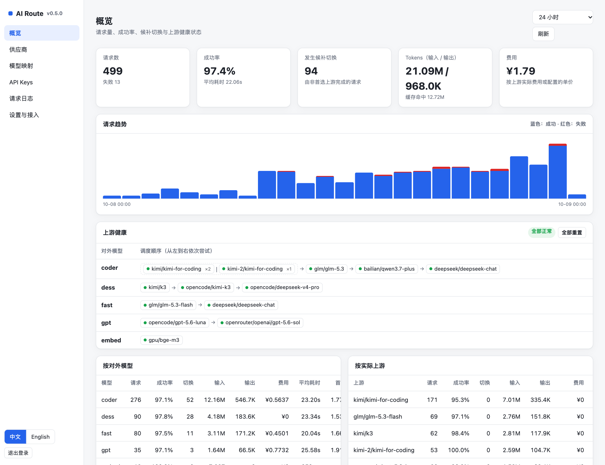
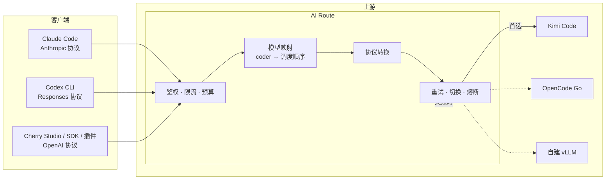
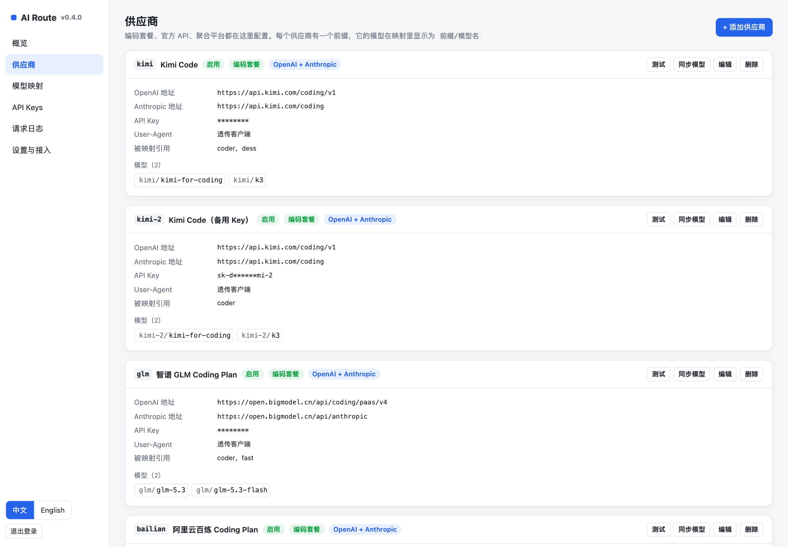
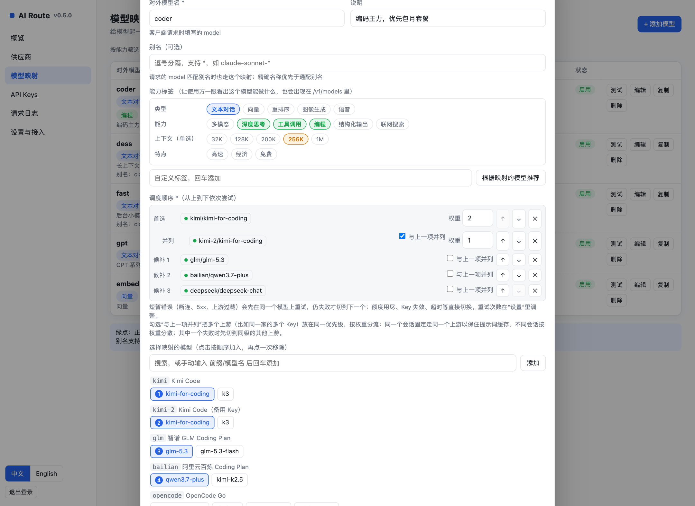
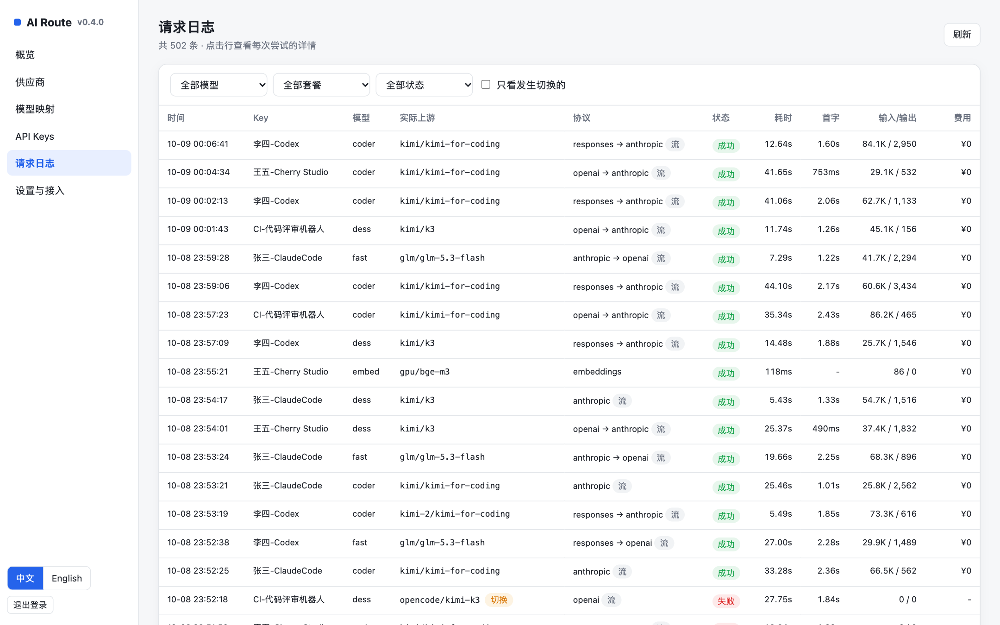
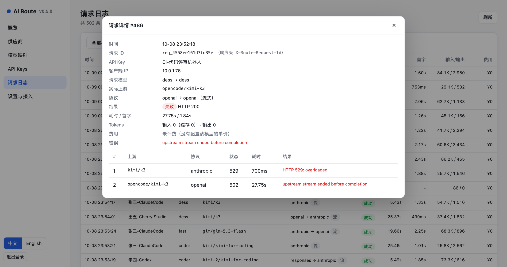
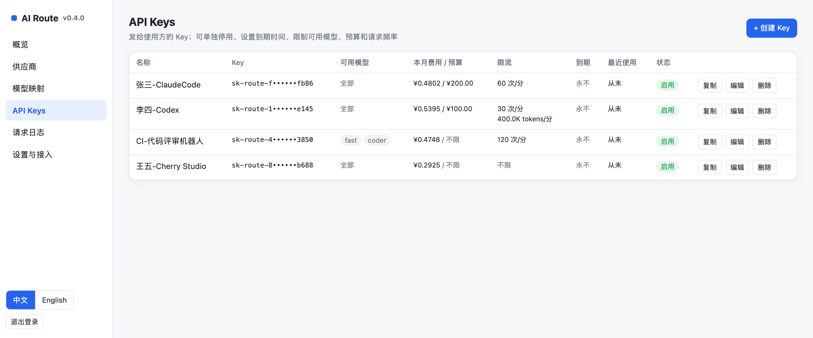
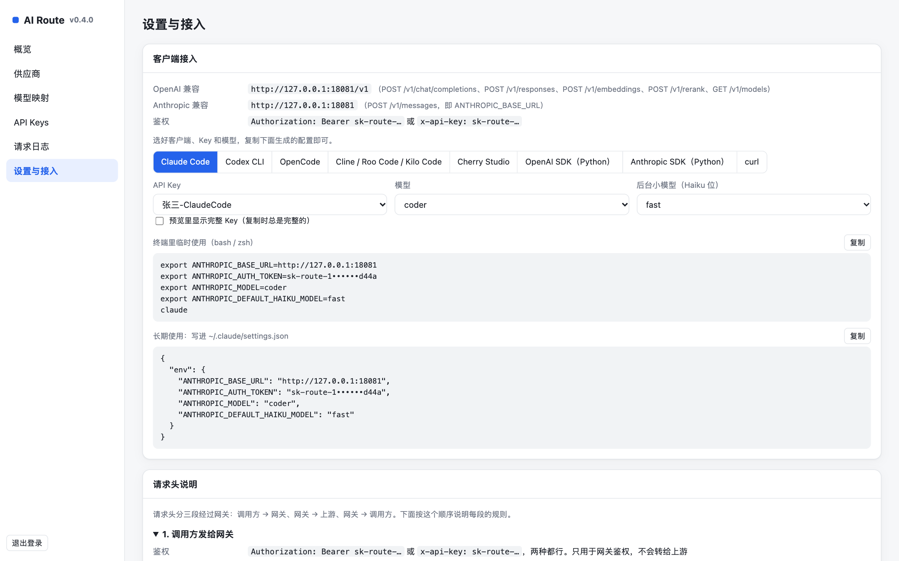

<div align="center">

# AI Route

**把手上的多个大模型套餐，变成一个稳定、好管理的 API 入口**

Kimi Code · GLM Coding Plan · 百炼 · 火山方舟 · OpenCode Go · OpenRouter · 自建 vLLM……一次接入，自动切换

[](https://github.com/kj648/ai-route/actions/workflows/ci.yml)
[](https://github.com/kj648/ai-route/tags)
[](go.mod)
[](LICENSE)

</div>



AI Route 是一个自托管的大模型 API 网关。你把各家套餐的地址和 Key 配进去，给模型起一个对外的名字，排好"先用谁、不行再用谁"的顺序，然后给自己和团队发网关的 Key。Claude Code、Codex、Cursor 系插件、Cherry Studio 等客户端只需要连这一个地址，剩下的事情由网关处理：选上游、转换协议、出错重试和切换、限流记账、出问题告警。

单个 Go 二进制，内置 SQLite 和 Web 控制台，没有外部依赖，`docker compose up -d` 即可运行。

## 为什么需要它

如果你同时用着几个编码套餐或按量 API，大概率遇到过这些问题：

- **每个客户端都要配一遍**：Claude Code 配一套，Codex 配一套，Cherry Studio 再配一套；换个套餐要改一圈。
- **额度用完、Key 失效要手动换**：写到一半被 429 打断，只能停下来改配置。
- **协议对不上**：Claude Code 只说 Anthropic 协议，Codex 只说 OpenAI Responses 协议，而你手上的套餐有的只给 OpenAI 接口，有的只给 Anthropic 接口。
- **团队共用时管不住**：谁用了多少、花了多少钱、能用哪些模型，都不清楚。

AI Route 就是为解决这些问题写的。

## 功能特性

**统一接入**
- 三种协议都提供：OpenAI 的 `/v1/chat/completions`、`/v1/responses`，Anthropic 的 `/v1/messages`，另有 `/v1/embeddings`、`/v1/rerank`、`/v1/models`。
- 上游有同协议端点就直通，没有就自动转换，流式和非流式都支持，包括工具调用、思考内容、图片和提示词缓存标记。
- 内置 40 个供应商预设（编码套餐、各家官方 API、聚合平台），选中后自动填好地址、协议规则和必要的请求头。

**智能调度**
- 给模型起对外名字（如 `coder`），按顺序映射到多个上游，前一个不可用就自动切下一个。
- 先重试再切换：网络抖动、5xx、短时限流先在同一个上游重试，避免会话被切走、提示词缓存失效。
- 熔断冷却：额度用尽、Key 失效时整个套餐冷却，冷却期间排到最后兜底，时长指数退避。
- 同级分流：同一优先级放多个上游（比如同一家的两个 Key），按权重分流，同一会话固定走同一个。

**管理与成本**
- 多个对外 Key：可以限制可用模型、设到期时间、月预算、每分钟请求数和 tokens。
- 请求日志记录实际走了哪个上游、切换了几次、耗时、首字时间、用量和费用。
- 成本核算：给按量模型配单价，OpenRouter 直接用实际扣费；概览按模型、上游、套餐、Key 汇总。
- 失效告警：推送到飞书、钉钉、企业微信群机器人或任意 Webhook。

**自建与扩展**
- 自建模型（vLLM、SGLang、Ollama 等）：并发上限与溢出、主动健康检查、单独的首包超时。
- 请求头模板：透传调用方的头，或按规则生成会话 ID 等动态值。
- 请求参数规则：按模型给请求体注入或删除参数，比如百炼 Qwen3 非流式时关闭思考。

## 工作原理



一个请求进来后：校验网关 Key 和限额 → 按请求里的 `model` 找到映射 → 按调度顺序挑上游（冷却中的排到最后）→ 转换成上游的协议 → 发出请求，遇到短暂错误先重试，仍失败再切下一个 → 把响应转回客户端的协议 → 记日志和费用。

## 快速开始

### 方式一：Docker Compose（推荐）

```bash
git clone https://github.com/kj648/ai-route.git
cd ai-route
cp .env.example .env        # 把 ADMIN_TOKEN 改成一串足够长的随机字符串
docker compose up -d --build
```

打开 `http://服务器:8080/admin/`，用 `ADMIN_TOKEN` 登录。数据保存在 Docker 卷 `ai-route-data` 里，重建容器不会丢。

> 国内构建时，如果 Docker Hub、`proxy.golang.org` 或 Alpine 官方源访问不畅，把 `.env.example` 末尾的国内配置复制到 `.env` 并取消注释即可：Go 模块走 `goproxy.cn`，基础镜像走 DaoCloud 镜像站，Alpine 软件源走阿里云。也可以先手动 `docker pull golang:1.27-alpine` 和 `docker pull alpine:3.22` 再构建。

### 方式二：直接运行

需要 Go 1.27 或更高版本：

```bash
go build -o bin/ai-route .
ADMIN_TOKEN=换成你的令牌 ./bin/ai-route                # 默认监听 :8080，数据在 ./data
./bin/ai-route -listen :9000 -data /var/lib/ai-route    # 也可以用参数
```

不设置 `ADMIN_TOKEN` 时，首次启动会生成一个 `admin-xxxx` 令牌，打印在日志里并保存到数据库。

| 环境变量 | 默认值 | 说明 |
|---|---|---|
| `LISTEN` | `:8080` | 监听地址 |
| `DATA_DIR` | `./data` | SQLite 数据目录 |
| `ADMIN_TOKEN` | 自动生成 | 管理后台令牌 |
| `HTTPS_PROXY` / `HTTP_PROXY` | – | 访问上游时使用的代理 |

### 五分钟上手

1. **添加供应商**：在“供应商”页面点“添加供应商”，选一个预设（比如 Kimi Code），填上 Key。模型列表会自动从上游拉取，拉不到就手动输入。
2. **建模型映射**：在“模型映射”页面添加一个对外模型，比如 `coder`，从下面点选要用的上游模型，点选的先后就是调度顺序。
3. **发 API Key**：在“API Keys”页面创建一个 Key，复制保存。
4. **接入客户端**：在“设置与接入”的接入向导里，选好客户端、Key 和模型，复制生成的配置。

用 curl 验证一下：

```bash
curl http://127.0.0.1:8080/v1/chat/completions \
  -H "Authorization: Bearer sk-route-你的Key" \
  -H "Content-Type: application/json" \
  -d '{"model":"coder","messages":[{"role":"user","content":"你好"}]}'
```

响应头 `X-Route-Target` 会告诉你这次实际走的是哪个上游。

## 截图

| 供应商 | 模型映射：调度顺序与同级分流 |
|---|---|
|  |  |
| **请求日志** | **请求详情：每次尝试与切换** |
|  |  |
| **API Keys：预算与限流** | **接入向导** |
|  |  |

## 客户端接入

| 协议 | Base URL | 端点 |
|---|---|---|
| OpenAI 兼容 | `http://服务器:8080/v1` | `POST /v1/chat/completions`、`POST /v1/responses`、`POST /v1/embeddings`、`POST /v1/rerank`、`GET /v1/models` |
| Anthropic 兼容 | `http://服务器:8080` | `POST /v1/messages`、`POST /v1/messages/count_tokens` |

鉴权用 `Authorization: Bearer sk-route-…` 或 `x-api-key: sk-route-…` 都可以。控制台“设置与接入”里的**接入向导**能直接生成下面这些配置。

<details open>
<summary><b>Claude Code</b></summary>

```bash
export ANTHROPIC_BASE_URL=http://服务器:8080
export ANTHROPIC_AUTH_TOKEN=sk-route-xxxx
export ANTHROPIC_MODEL=coder
export ANTHROPIC_DEFAULT_HAIKU_MODEL=fast
claude
```

长期使用可以写进 `~/.claude/settings.json` 的 `env` 字段。给 `fast` 加别名 `claude-*haiku*`，Claude Code 的后台小模型请求就会自动落到它上面。
</details>

<details>
<summary><b>Codex CLI</b></summary>

Codex 只支持 Responses API，网关会按上游自动转换。在 `~/.codex/config.toml` 里写：

```toml
model = "coder"
model_provider = "ai-route"

[model_providers.ai-route]
name = "AI Route"
base_url = "http://服务器:8080/v1"
env_key = "AI_ROUTE_API_KEY"
wire_api = "responses"
```

然后 `export AI_ROUTE_API_KEY=sk-route-xxxx`，再运行 `codex`。
</details>

<details>
<summary><b>OpenCode</b></summary>

在项目根目录的 `opencode.json`（或 `~/.config/opencode/opencode.json`）里加一个 provider：

```json
{
  "$schema": "https://opencode.ai/config.json",
  "provider": {
    "ai-route": {
      "npm": "@ai-sdk/openai-compatible",
      "name": "AI Route",
      "options": { "baseURL": "http://服务器:8080/v1", "apiKey": "sk-route-xxxx" },
      "models": { "coder": { "name": "coder" } }
    }
  }
}
```
</details>

<details>
<summary><b>Cline / Roo Code / Kilo Code、Cherry Studio、各种 SDK</b></summary>

- **Cline / Roo Code / Kilo Code**：API Provider 选 OpenAI Compatible，Base URL 填 `http://服务器:8080/v1`，Model ID 填对外模型名。
- **Cherry Studio**：设置 → 模型服务 → 添加，类型选 OpenAI，API 地址填 `http://服务器:8080`。
- **OpenAI SDK**：`OpenAI(base_url="http://服务器:8080/v1", api_key="sk-route-xxxx")`
- **Anthropic SDK**：`Anthropic(base_url="http://服务器:8080", api_key="sk-route-xxxx")`
</details>

## 配置详解

### 供应商

在“供应商”页面添加。同一家厂商的**编码套餐**和**按量 API** 是两个预设，因为地址和 Key 不通用，比如 Kimi Code 和 Kimi 开放平台。

| 分类 | 预设 |
|---|---|
| 编码套餐 | Kimi Code（国内 / 海外）、智谱 GLM Coding Plan、Z.ai Coding Plan、阿里云百炼 Coding Plan、QwenCloud Coding、千问 Token Plan、火山方舟 Coding Plan / Agent Plan、BytePlus Coding Plan、MiniMax Token Plan（国内 / 国际）、OpenCode Go、阶跃 Step Plan、腾讯云 Token Plan、百度千帆 Token Plan、KAT-Coder |
| 官方 API（按量） | Kimi 开放平台（国内 / 海外）、智谱开放平台、Z.ai、阿里云百炼、火山方舟、DeepSeek、MiniMax、阶跃星辰、腾讯混元、小米 MiMo、美团 LongCat、OpenAI、Anthropic、Google Gemini、xAI |
| 聚合平台 | OpenCode Zen、OpenRouter、硅基流动、魔搭 ModelScope、Novita、AiHubMix、PackyCode |

> 预设定义在 [web/presets.js](web/presets.js)，整理自各家官方文档（2026-10）。套餐经常调整，**请以厂商控制台为准**，添加后点“测试”验证。

- **前缀**：每个供应商有一个前缀，它的模型在映射里写作 `前缀/模型名`。前缀自动生成：预设用预设的前缀；自定义的从域名提取（`api.deepseek.com` → `deepseek`）；重名时加数字后缀（`kimi`、`kimi-2`）。创建后固定不变。
- **地址**：OpenAI 兼容地址和 Anthropic 兼容地址至少填一个。客户端用哪种协议，就优先走同协议的地址，没有就自动转换。
- **模型协议规则**：某些模型只在一种端点上提供时使用，每行 `模型(可用*) = openai|anthropic|responses`。比如 OpenCode Go 的 MiniMax 只走 `/messages`，GPT Luna 只走 `/responses`，预设已填好。
- **Responses API 开关**：勾选“OpenAI 地址也支持 Responses API”后，Codex 等客户端的请求原样转发；不勾选就转成 Chat Completions。OpenAI 官方预设已勾选；Kimi、GLM、DeepSeek 等多数兼容厂商没有 `/responses`，不要勾。
- **单价**：见[成本核算](#成本核算)。

#### User-Agent 策略

部分编码套餐按 User-Agent 识别客户端，每个供应商可以单独设置：

| 策略 | 行为 | 适用 |
|---|---|---|
| 透传客户端（默认） | 转发调用方的 UA（如 Claude Code 的 `claude-cli/…`）；调用方没带时用供应商里填的值，再没有就用 `ai-route/<版本号>` | 绝大多数情况，**Kimi Code 必须用这个** |
| 平台标识 | 总是发 `ai-route/<版本号>` | 自建模型、中转平台等需要识别来源的上游 |
| 固定 UA | 总是发填写的值 | 只在厂商明确要求某个固定 UA 时使用 |

Kimi Code 的会员条款规定篡改客户端标识（User-Agent）视为违规；OpenCode Go 要求客户端用自己的 UA。后台“测试”按钮发出的 UA 是 `ai-route-admin-test`，限制客户端的套餐可能返回 403，这时请用实际客户端经网关测一次。

#### 请求头

调用方的请求头**默认透传**给上游，但凭证（`Authorization`、`x-api-key`、`Cookie`）、`Accept-Encoding`、逐跳头、暴露用户身份的头（`X-Forwarded-*`、`Origin`、`Referer`、`Sec-*`、`CF-*`）以及对面协议专属的头不会转发。个别上游对多余请求头敏感时，可以在“高级设置”里关掉透传。

“自定义请求头”每行写 `Header: 值`，会覆盖调用方的同名头，值留空表示删除。值支持模板：

| 写法 | 含义 |
|---|---|
| `X-Foo: abc` | 固定值 |
| `X-Foo: {{header.X-Bar}}` | 取调用方的 `X-Bar`，**必传**：首选上游要求而调用方没带时直接返回 400；候补上游缺了就不发 |
| `X-Foo: {{header.X-Bar?}}` | 取调用方的值，可选 |
| `X-Foo: {{header.X-Bar ?? $conversation}}` | 调用方带了用它的，没带由平台生成；也可以写 `?? "默认值"` |
| `X-Trace: ai-route-{{$requestId}}` | 内置变量，可以和文字拼接 |

内置变量：`$conversation`（`ses_` 开头，同一会话内不变）、`$uuid`（每个请求一个新的）、`$requestId`（网关请求 ID，也在响应头 `X-Route-Request-Id` 里）、`$timestamp`、`$keyName`、`$keyId`、`$model`。变量写错或者引用凭证类的头，保存时会报错。

例如 OpenCode Go 预设写的是：

```
x-opencode-session: {{header.x-opencode-session ?? header.x-claude-code-session-id ?? header.session-id ?? $conversation}}
```

依次取：调用方自己的会话 ID → Claude Code 自带的 `x-claude-code-session-id` → Codex 自带的 `session-id` → 网关按会话生成。控制台“设置与接入 → 请求头说明”整理了完整规则和各厂商要求的出处。

#### 请求参数规则

某些模型要求额外参数时使用，每行写 `模型(可用*) [条件] = JSON`，JSON 会深度合并进发给上游的请求体（协议转换之后），值写 `null` 表示删除该字段。条件可选：`stream` / `nonstream`，`openai` / `anthropic` / `responses` / `embeddings` / `rerank`。例如百炼的 Qwen3 开源模型默认开启思考，非流式调用必须关掉（“阿里云百炼（按量）”预设已内置）：

```
qwen3-* [nonstream, openai] = {"enable_thinking": false}
```

#### 自建模型

自己部署的模型（vLLM、SGLang、Ollama、LM Studio 等）按“自定义”添加，地址填 `http://服务器:端口/v1`，在“高级设置 → 自建模型”里可以设置：

| 设置 | 作用 |
|---|---|
| 最大并发 | 同时在途的请求上限。满了直接溢出到下一个候补，不算失败；所有候补都失败、只剩满载的自建模型时，排队等空位（默认最多 30 秒），等不到返回 429 |
| 首包超时 | 流式请求等第一个事件的最长时间，超过就切换，适合 GPU 排队时快速转走 |
| 健康检查 | 定期 `GET` 模型列表接口（也可以自定义地址），连续 2 次失败就移出调度，恢复后自动加回，移出和恢复都会告警 |

### 模型映射

- **对外模型名**：客户端请求里 `model` 填的值，如 `coder`、`fast`。
- **调度顺序**：从下面按套餐分组的模型里依次点选，之后可以用 ↑↓ 调整。
- **同级分流**：勾选“与上一项并列”把多个上游放在同一优先级并设置权重（存储为 `kimi/k3*2 | kimi-2/k3`）。按“API Key + 会话第一条用户消息”做加权一致性哈希：同一会话固定走同一个上游以保住提示词缓存，不同会话按权重分散；其中一个失败时先切到同级的其他上游。
- **别名**：支持 `*` 通配，比如给 `fast` 加别名 `claude-*haiku*`。精确名称优先于通配别名。
- **能力标签**：类型、能力、上下文长度、高速 / 经济等，显示在列表里，也会出现在 `/v1/models` 的扩展字段里。可以根据映射的模型一键推荐，只推荐所有候补都具备的能力。

| 对外模型 | 调度顺序示例 |
|---|---|
| `coder` | `kimi/kimi-for-coding*2 \| kimi-2/kimi-for-coding` → `glm/glm-5.3` → `bailian/qwen3.7-plus` |
| `fast` | `glm/glm-5.3-flash` → `deepseek/deepseek-chat` |
| `gpt` | `opencode/gpt-5.6-luna` → `openrouter/openai/gpt-5.6-sol` |

### API Key

Key 由平台自动生成（`sk-route-` 加 48 位十六进制），泄露时点“重新生成”，旧 Key 立即失效。每个 Key 可以限制可用模型、设置到期时间，以及：

| 限制 | 超出时 | 说明 |
|---|---|---|
| 月预算 | 返回 402（OpenAI 格式为 `insufficient_quota`，Anthropic 格式为 `billing_error`），每月 1 日恢复 | 按成本核算的费用累计，单位是统计货币 |
| RPM | 返回 429，带 `Retry-After` | 最近 60 秒滑动窗口 |
| TPM | 返回 429，带 `Retry-After` | 最近 60 秒内已完成请求的输入 + 输出 tokens |

被拒绝的请求也会记日志，不会发给上游。

### 成本核算

- **单价**：在供应商的“高级设置”里，每行 `模型(可用*) = 输入 / 缓存命中 / 输出`，单位是每百万 tokens，货币可选人民币或美元。缓存价可以省略，省略时按输入价计。
- **OpenRouter**：直接使用响应里的实际扣费（`usage.cost`）。
- **包月套餐**：写一行 `* = 0 / 0` 表示不另外收费；没配单价的请求会在概览里提示“未计入”，以免漏配。
- **货币换算**：日志保留原始货币，概览统一换算成设置里的统计货币。
- **口径**：费用 = (输入 − 缓存命中) × 输入价 + 缓存命中 × 缓存价 + 输出 × 输出价。Anthropic 的缓存写入按输入价计（官方实际是 1.25 倍），思考 tokens 包含在输出里。

### 告警通知

在“设置与接入 → 告警通知”里添加 Webhook，每个都可以单独发送测试：

| 类型 | 说明 |
|---|---|
| 飞书 / Lark | 支持签名校验 |
| 钉钉 | 支持“加签”（`SEC` 开头的密钥） |
| 企业微信 | 群机器人地址即可 |
| 通用 JSON | 收到 `POST {event, subject, title, text, time}` |

触发条件：上游返回 401 / 402（Key 失效、欠费）、某个模型的整条调度链全部失败、套餐或模型一次冷却超过阈值（默认 10 分钟）、自建模型健康检查失败或恢复。同一件事在静默时间（默认 30 分钟）内只推送一次。消息都以 `[AI Route]` 开头，机器人用“自定义关键词”时填 `AI Route` 即可。

## 路由、重试与熔断

同一个上游上**先判断要不要重试，再决定是否切换**：

| 错误 | 处理 | 理由 |
|---|---|---|
| 断连、5xx / 408 / 529、200 但内容是错误、流式首包报错 | 同一上游重试（默认 2 次，间隔 1s、2s），仍失败再切换 | 典型的短暂抖动，重试能保住提示词缓存 |
| 429 且 `Retry-After` ≤ 10 秒 | 等待后重试 | 短时限流 |
| 429 要等很久、401、402 | 直接切换，并冷却**整个套餐** | 额度用尽、Key 失效、欠费 |
| 404 | 直接切换，并冷却**该模型** | 模型不存在 |
| 超时 | 直接切换 | 已经等满了超时时间 |
| 400 / 403 / 413 等 | 直接切换，不冷却 | 一般是请求本身的问题 |

- 流式响应一旦开始向客户端输出，就不能再重试或切换；中途断开时，网关会给客户端发一个错误事件。
- 一个上游连续 2 次请求失败（重试后仍失败）就冷却，时长从 60 秒起每次翻倍，最长 30 分钟。冷却中的上游排到最后兜底，只试一次；成功一次即清零。
- 以上参数都可以在“设置与接入”里调整。

## 协议转换

| 客户端 → 上游 | 处理方式 |
|---|---|
| 同协议 | 直通，只改写 `model` 字段 |
| OpenAI ⇄ Anthropic | 系统消息、工具调用与结果、图片、思考内容、`cache_control` 互相转换；流式事件逐个转换 |
| Responses ⇄ Chat | `instructions` / `developer` → `system`，`function_call` ⇄ `tool_calls`；Codex 的自定义工具（如 `apply_patch`）转成单个字符串参数的函数，结果再还原；内置工具（`web_search` 等）没有对应物会被丢弃 |
| Responses ⇄ Anthropic | 以 Chat 为中转 |

- **`reasoning_effort`**：发给 Claude Opus / Sonnet 4.6 及以后、Fable 时转成 `thinking: {type: "adaptive"}` 加 `output_config.effort`，并去掉新模型不接受的参数；发给其他模型时转成 `budget_tokens`。
- **`response_format`**：上游是 Anthropic 官方且为严格 JSON Schema 时，转成原生结构化输出；其他情况在系统提示词末尾要求“只输出 JSON”。
- **Responses API 的限制**：网关不保存会话状态，所以转到非 Responses 上游时不支持 `previous_response_id` 和 `conversation`（返回 400，Codex 默认每次发完整历史，不受影响）。

## 部署与安全

- **HTTPS**：对公网开放时，建议在前面加一层反向代理。流式响应需要关闭缓冲（网关已返回 `X-Accel-Buffering: no`）：

  ```nginx
  location / {
      proxy_pass http://127.0.0.1:8080;
      proxy_http_version 1.1;
      proxy_set_header Host $host;
      proxy_set_header X-Real-IP $remote_addr;
      proxy_set_header X-Forwarded-For $proxy_add_x_forwarded_for;
      proxy_buffering off;
      proxy_read_timeout 600s;
  }
  ```

  Caddy 只需要一行：`reverse_proxy 127.0.0.1:8080 { flush_interval -1 }`。
- **数据安全**：上游 Key 以明文存放在 SQLite 里，请控制好数据目录和管理令牌的访问权限。日志里的客户端 IP 取自 `X-Forwarded-For`，直接暴露在公网时这个头可以被伪造。
- **备份与迁移**：“设置与接入”里可以导出 / 导入全部配置（JSON，包含上游 Key，请妥善保管）。
- **单实例**：熔断、限流计数、并发槽保存在进程内存里，目前只支持单实例部署；重启后熔断状态清空，本月费用从日志重新统计。

## 常见问题

<details>
<summary><b>本机用 curl 调用没有任何输出</b></summary>

多半是终端设置了 `http_proxy` 之类的代理环境变量，请求被发给了代理。加 `--noproxy '*'` 试一下；确认后，把 `127.0.0.1,localhost` 加进 `no_proxy`，或者在代理软件里让本机地址直连。
</details>

<details>
<summary><b>docker compose 构建时卡在 Docker Hub 或超时</b></summary>

国内网络访问 Docker Hub、`proxy.golang.org` 不稳定。把 `.env.example` 末尾的国内配置复制到 `.env`，或者先手动拉好基础镜像再构建。
</details>

<details>
<summary><b>Kimi Code 返回 403</b></summary>

Kimi Code 只接受编码工具的请求。供应商的 User-Agent 策略要保持“透传客户端”，并用 Claude Code 等实际客户端经网关调用；后台“测试”按钮的 UA 会被拒绝，属于正常现象。
</details>

<details>
<summary><b>从上游拉取不到模型列表</b></summary>

很多编码套餐不开放 `/models` 接口。在供应商表单里手动输入模型名，回车添加即可。
</details>

<details>
<summary><b>忘记管理令牌</b></summary>

设置 `ADMIN_TOKEN` 环境变量后重启，会以它为准。
</details>

<details>
<summary><b>Codex 报 previous_response_id 不支持</b></summary>

只在上游不是 Responses API 时出现。Codex 默认 `store: false` 并发送完整历史，不会触发；如果你的客户端依赖服务端会话，请把模型映射到支持 Responses API 的上游。
</details>

## 管理 API

控制台的所有操作都可以通过 `/admin/api/*` 完成（`Authorization: Bearer <ADMIN_TOKEN>`），例如：

```bash
curl -H "Authorization: Bearer $ADMIN_TOKEN" http://127.0.0.1:8080/admin/api/providers
curl -H "Authorization: Bearer $ADMIN_TOKEN" "http://127.0.0.1:8080/admin/api/stats?range=24h"
```

常用端点：`providers`、`models`、`keys`、`logs`、`stats`、`status`、`settings`、`alerts`、`export`、`import`。

## 开发

```bash
go test -race ./...      # 用模拟上游跑全部测试，不需要任何真实 Key
go build -o bin/ai-route .
```

```
main.go               入口：参数、内嵌静态资源、HTTP 服务
internal/gateway      对外 API、路由与切换、熔断、限流、并发与健康检查、请求头处理
internal/convert      OpenAI Chat / Responses / Anthropic 之间的请求、响应、流式转换
internal/store        SQLite 存储、配置快照、请求日志与统计
internal/admin        管理 API
internal/alert        告警推送（飞书、钉钉、企业微信、Webhook）
internal/hdrtpl       请求头模板
web/                  控制台前端（原生 JS，无构建步骤）
```

测试覆盖协议互转（含流式事件顺序）、重试与熔断、模型映射与同级分流、限流与预算、费用计算、告警签名、请求头模板、自建模型的并发与健康检查等，全部使用模拟上游。

## 路线图

- [ ] 英文 README 与控制台中英文切换
- [ ] 发布预编译二进制和 Docker 镜像
- [ ] 多管理员账号与操作审计
- [ ] 多实例部署（共享熔断与限流状态）

欢迎在 Issues 里提需求。

## 参与贡献

欢迎提交 Issue 和 Pull Request。提交前请确保：

- `gofmt -l .` 没有输出，`go vet ./...` 和 `go test -race ./...` 通过；
- 新功能附带测试（参照 `internal/gateway/*_test.go` 里的模拟上游写法）；
- 新增或修改供应商预设时，在 PR 里附上官方文档链接。

## 免责声明

- 部分编码套餐的条款限定只能在官方支持的编码工具中使用，或者禁止“自建后端 / 代理转发 / 自动化调用”（例如百炼 Coding Plan、GLM Coding Plan、Kimi Code 都有类似条款）。**通过本项目转发是否合规，请自行阅读并遵守各厂商的服务条款，由此产生的封号、扣费等后果由使用者自行承担。**
- 本项目与文中提到的任何厂商均无关联，预设信息仅供参考，以各厂商官方说明为准。

## 许可证

[MIT](LICENSE)
